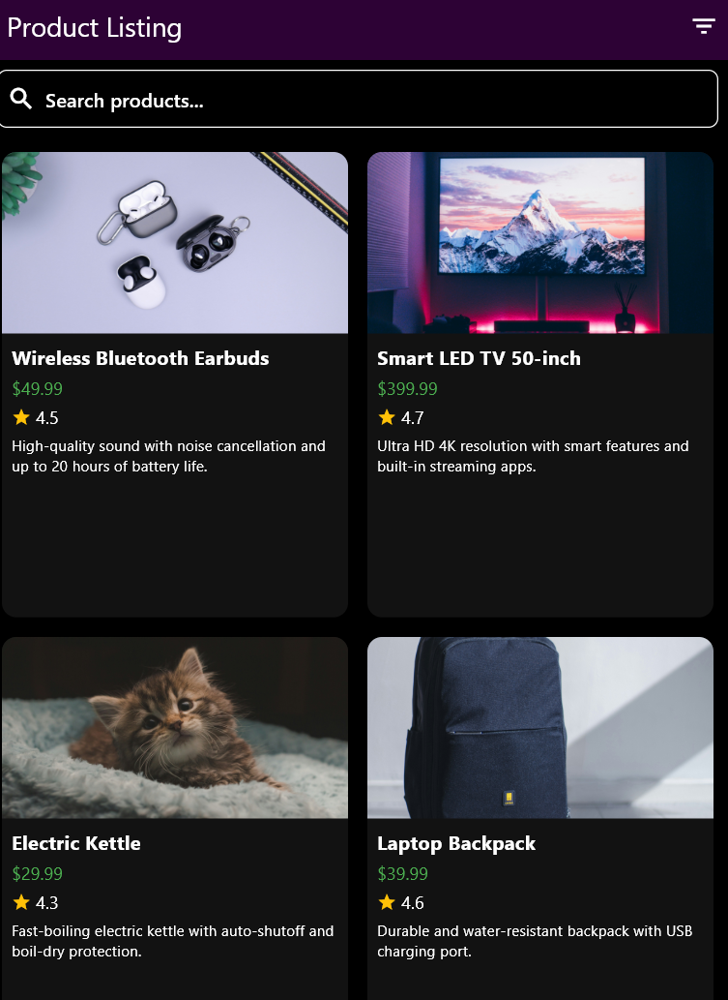
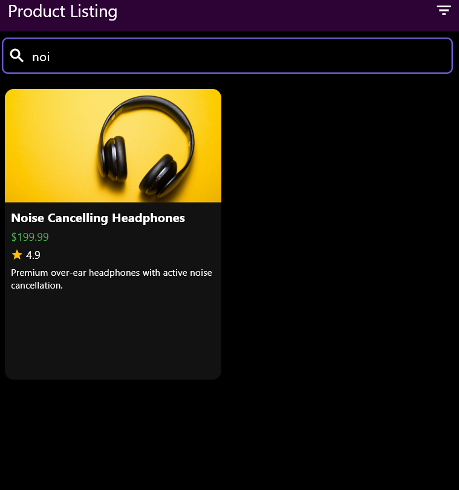
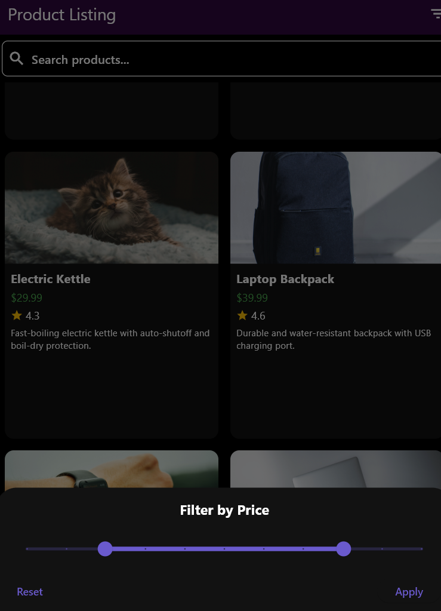
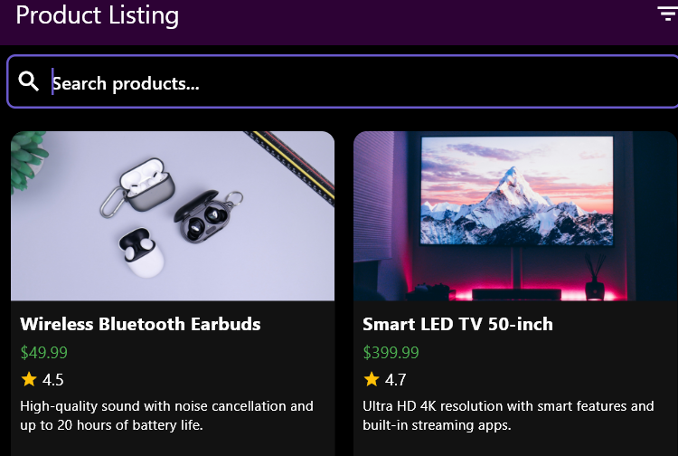

# Product Listing App

This is a product listing app built with Flutter. It allows users to view a list of products, filter them based on price range, and search for products by name. The app also integrates BLoC (Business Logic Component) to manage state efficiently.

## Features

- Product listing with details.
- Search functionality to filter products by name.
- Filter products by price range.
- UI with gradient background and custom search bar.
- BLoC pattern for state management.

## Screenshots and Video Demo

### Screenshots

| Product Listing View | Search Functionality | Filter by Price Range |
|----------------------|----------------------|-----------------------|
|  |  |  |

### Video Demo

[](products/screenshots/demo_video.mp4)

---

## Project Structure

- `lib/`
  - `blocs/` - Contains all BLoC related files (business logic components).
    - `product/` - Manages product-related logic.
    - `filter/` - Manages filter-related logic.
  - `models/` - Contains the `Product` model.
  - `repositories/` - Contains the `ProductRepository` for fetching product data.
  - `screens/` - Contains the screens for displaying the UI.
  - `widgets/` - Contains reusable widgets like `ProductCard`, `SearchBar`, and `FilterBottomSheet`.
  - `theme/` - Contains app themes and styling.

## Installation

### Prerequisites

Make sure you have the following installed on your machine:

- Flutter (latest stable version)
- Dart SDK

### Steps to Install and Run

1. Clone the repository to your local machine:

   ```bash
   git clone https://github.com/Tamilmughilan/Product-Listing
   ```

2. Navigate to the project directory:

   ```bash
   cd product-listing-app
   ```

3. Install the dependencies:

   ```bash
   flutter pub get
   ```

4. Run the app on an emulator or connected device:

   ```bash
   flutter run
   ```

## Architecture

This project follows the BLoC pattern for state management, ensuring a clean separation of business logic and UI. Here's an overview of the key components:

- **ProductBloc**: Manages the loading, searching, and filtering of products.
- **FilterBloc**: Manages the state of the filters (price range).
- **ProductCard**: Displays product details in a card format.
- **SearchBar**: Custom search bar widget for searching products by name.
- **FilterBottomSheet**: Bottom sheet widget for selecting price range filters.

## Dependencies

- `flutter_bloc`: For state management using the BLoC pattern.
- `provider`: For dependency injection and managing app-wide state.
- `http`: For making HTTP requests (if you're fetching product data from a remote server).
- `equatable`: For value comparison in state classes.

## Future Improvements

- Add product sorting functionality (e.g., by price, name, or rating).
- Improve error handling for network requests.
- Add unit and widget tests for the BLoC and widgets.


